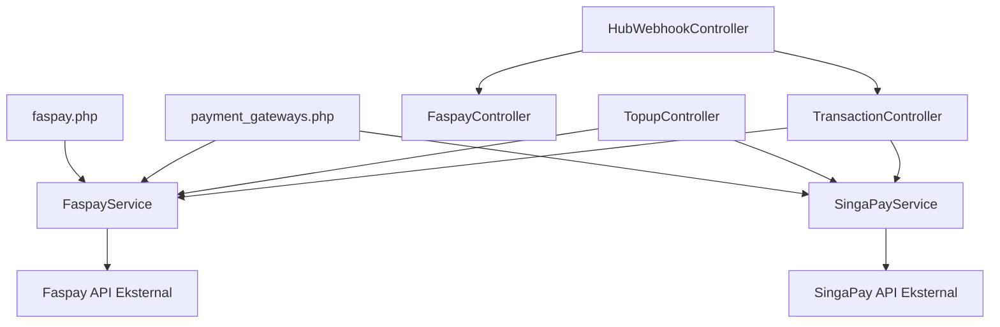
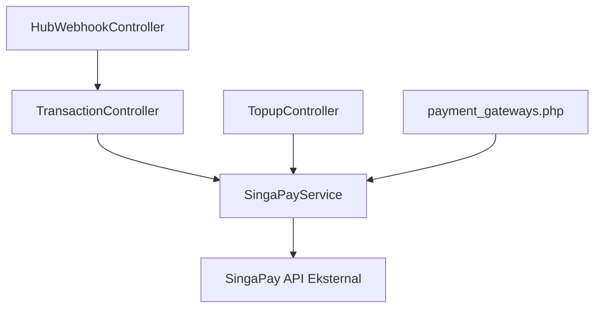
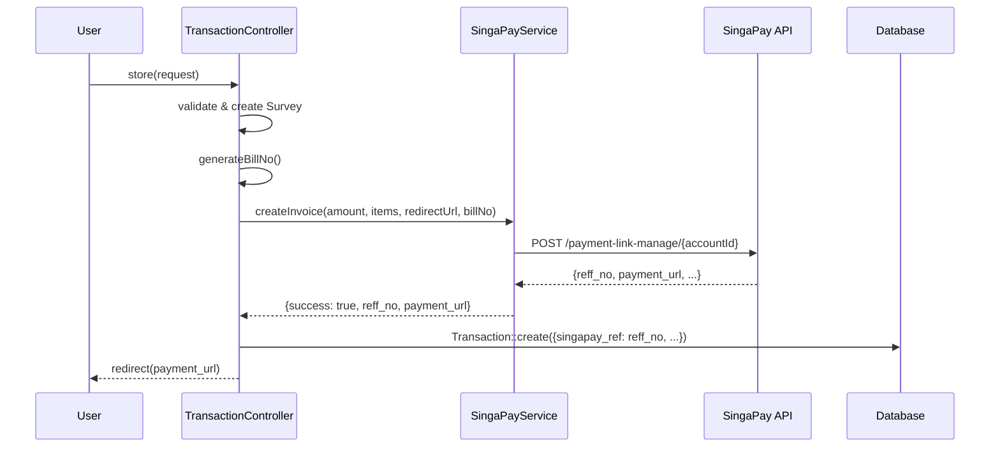
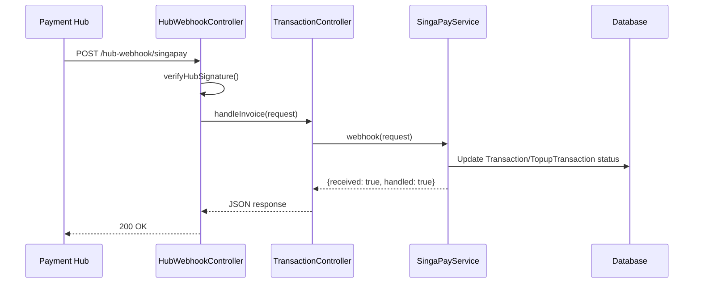

# Dokumen Desain: Remove Faspay Gateway

## Ringkasan

Fitur ini menghapus seluruh integrasi payment gateway Faspay dari proyek Survey Grapadi, menjadikan SingaPay sebagai satu-satunya payment gateway yang digunakan. Perubahan mencakup refactoring controller (TransactionController, TopupController, PaymentController, HubWebhookController), penyederhanaan konfigurasi, penghapusan route, penghapusan file, dan migrasi database.

Tujuan utamanya adalah menyederhanakan codebase tanpa mengganggu alur pembayaran yang sudah berjalan. Semua alur pembayaran (survey dan top-up) akan menggunakan `SingaPayService::createInvoice()` yang sudah terbukti berfungsi di TopupController.

## Arsitektur

### Arsitektur Sebelum Penghapusan



### Arsitektur Setelah Penghapusan



## Komponen dan Interface

### Komponen 1: TransactionController (Refactored)

**Tujuan**: Menangani pembuatan dan pemrosesan pembayaran transaksi survey menggunakan SingaPay.

**Interface setelah refactoring**:

```php
class TransactionController extends Controller
{
    private SingaPayService $singaPay;
    private FormLinkValidationService $formLinkValidationService;

    public function __construct(
        SingaPayService $singaPay,
        FormLinkValidationService $formLinkValidationService
    );

    public function store(Request $request);         // Membuat survey + invoice SingaPay
    public function processPayment(Request $request, Transaction $transaction); // Proses ulang pembayaran
    public function handleInvoice(Request $request); // Webhook handler SingaPay (tidak berubah)
}
```

**Tanggung Jawab**:
- Mengganti dependency `FaspayService` dengan `SingaPayService`
- Menggunakan pola yang sama seperti `TopupController::processSingaPayPayment()`
- Menyimpan `singapay_ref` dari response ke model Transaction
- Redirect user ke `payment_url` dari response SingaPay

### Komponen 2: TopupController (Simplified)

**Tujuan**: Menangani top-up saldo pengguna hanya melalui SingaPay.

**Perubahan**:
- Hapus method `processFaspayPayment()`
- Hapus import `use App\Services\FaspayService`
- Hapus percabangan `if ($selectedGateway === 'faspay')` di method `store()`
- Selalu gunakan `processSingaPayPayment()` untuk pembayaran non-mock

### Komponen 3: HubWebhookController (Cleaned)

**Tujuan**: Menerima webhook dari Payment Callback Hub hanya untuk SingaPay.

**Perubahan**:
- Hapus method `faspay()`
- Hapus import `FaspayController`
- Pertahankan method `singapay()` dan `verifyHubSignature()` tanpa perubahan

### Komponen 4: PaymentController (Cleaned)

**Tujuan**: Controller pembayaran saldo yang tidak lagi mereferensi FaspayService.

**Perubahan**:
- Hapus baris `use App\Services\FaspayService`
- Tidak ada perubahan logika

### Komponen 5: Konfigurasi payment_gateways.php (Simplified)

**Tujuan**: File konfigurasi yang hanya mendefinisikan SingaPay sebagai gateway.

**Interface setelah penyederhanaan**:

```php
return [
    'mock_mode' => env('PAYMENT_MOCK_MODE', false),
    'mock_default_status' => env('PAYMENT_MOCK_DEFAULT_STATUS', 'paid'),
    'invoice_prefix' => strtoupper(trim((string) env('PAYMENT_INVOICE_PREFIX', 'TRX'))) ?: 'TRX',
    'order' => ['singapay'],
    'default' => 'singapay',
    'gateways' => [
        'singapay' => [
            'label' => 'SingaPay',
            'enabled' => env('PAYMENT_GATEWAY_SINGAPAY_ENABLED', true),
            'configured' => $mockMode || (
                !empty(env('SINGAPAY_API_KEY'))
                && !empty(env('SINGAPAY_CLIENT_ID'))
                && !empty(env('SINGAPAY_CLIENT_SECRET'))
                && !empty(env('SINGAPAY_ACCOUNT_ID'))
            ),
        ],
    ],
];
```

## Sequence Diagram

### Alur Pembayaran Survey (Setelah Refactoring)



### Alur Webhook SingaPay (Tidak Berubah)



## Model Data

### Transaction (Tidak berubah strukturnya)

```php
// Field yang relevan untuk SingaPay:
interface TransactionFields {
    'survey_id': int;
    'user_id': int;
    'amount': float;
    'status': string;          // pending, processing, paid, failed
    'singapay_ref': string;    // reff_no dari SingaPay
    'bill_no': string;         // nomor bill internal
    'payment_ref': string;     // referensi pembayaran
    'payment_method': string;  // QRIS, VA_BCA, dll (diisi webhook)
}
```

### SingaPayService::createInvoice() Response

```php
// Response sukses:
[
    'success' => true,
    'reff_no' => 'RC...',          // Referensi unik dari SingaPay
    'payment_url' => 'https://...', // URL untuk redirect user
    'message' => '...',
]

// Response gagal:
[
    'success' => false,
    'message' => 'Error description',
]
```

## Daftar File yang Dihapus

| File | Alasan |
|------|--------|
| `app/Services/FaspayService.php` | Service class Faspay tidak diperlukan |
| `config/faspay.php` | Konfigurasi Faspay tidak diperlukan |
| `app/Http/Controllers/FaspayController.php` | Controller Faspay tidak diperlukan |
| `app/Http/Controllers/FaspayTestTransactionController.php` | Controller test Faspay tidak diperlukan |
| `app/Models/FaspayTestTransaction.php` | Model test Faspay tidak diperlukan |
| `resources/views/faspay/` (seluruh direktori) | Views Faspay tidak diperlukan |
| `tests/Feature/FaspayWebhookNotificationTest.php` | Test Faspay tidak diperlukan |
| `tests/Feature/FaspayPaymentProcessTest.php` | Test Faspay tidak diperlukan |

## Route yang Dihapus

| Route | File | Keterangan |
|-------|------|------------|
| `GET /transaction/faspay/return` | web.php | Return URL Faspay |
| `POST /api/webhook/faspay/notification` | web.php | Webhook notification Faspay |
| `GET faspay/debug` | web.php | Debug route Faspay |
| `GET faspay/list-transactions` | web.php | List transactions route |
| Semua route `faspay/test/*` | web.php | Test transaction routes |
| `POST /hub-webhook/faspay` | api.php | Hub webhook Faspay |

## Migrasi Database

### Migration: drop_faspay_test_transactions_table

```php
public function up(): void
{
    Schema::dropIfExists('faspay_test_transactions');
}

public function down(): void
{
    Schema::create('faspay_test_transactions', function (Blueprint $table) {
        $table->id();
        $table->string('bill_no')->unique();
        $table->decimal('amount', 12, 2);
        $table->string('status')->default('pending');
        $table->string('trx_id')->nullable();
        $table->string('payment_url')->nullable();
        $table->json('webhook_payload')->nullable();
        $table->timestamps();
    });
}
```

## Penanganan Error

### Skenario 1: SingaPay API Gagal di TransactionController

**Kondisi**: `SingaPayService::createInvoice()` mengembalikan `['success' => false]`
**Respons**: Redirect kembali ke halaman sebelumnya dengan pesan error
**Pemulihan**: User dapat mencoba lagi

### Skenario 2: Referensi Faspay Tersisa di Kode

**Kondisi**: Setelah semua perubahan, masih ada referensi ke class Faspay
**Respons**: PHP autoloader akan throw error (class not found)
**Pemulihan**: Identifikasi dan hapus referensi tersisa

### Skenario 3: Route Faspay Masih Diakses

**Kondisi**: External service masih memanggil URL Faspay lama
**Respons**: Laravel akan return 404 Not Found
**Pemulihan**: Tidak diperlukan — URL tersebut tidak lagi valid

## Strategi Testing

### Unit Testing

- Verifikasi TransactionController menggunakan SingaPayService (bukan FaspayService)
- Verifikasi TopupController tidak lagi memiliki branch Faspay
- Verifikasi konfigurasi hanya berisi SingaPay

### Integration Testing

- Verifikasi alur lengkap pembayaran survey melalui SingaPay (mock API)
- Verifikasi alur lengkap top-up melalui SingaPay (mock API)
- Verifikasi webhook SingaPay tetap berfungsi normal

### Validasi Integritas

- Jalankan `php artisan route:list` untuk memastikan tidak ada route Faspay
- Jalankan `grep -r "Faspay\|FaspayService\|FaspayController" app/ config/ routes/` untuk memastikan tidak ada referensi tersisa
- Jalankan `composer dump-autoload` dan `php artisan optimize` tanpa error

## Dependensi

| Dependensi | Status |
|------------|--------|
| `SingaPayService` | Sudah ada, tidak berubah |
| `SingaPay API` | Sudah terintegrasi |
| Database `transactions` table | Tidak berubah |
| Database `topup_transactions` table | Tidak berubah |
| Payment Callback Hub | Hanya perlu hapus forward rule Faspay di hub |

## Correctness Properties

*Property adalah karakteristik atau perilaku yang harus selalu benar di seluruh eksekusi sistem yang valid — secara formal, pernyataan tentang apa yang harus dilakukan sistem.*

### Property 1: Integritas Alur Pembayaran

*Untuk setiap* request pembayaran valid (baik survey maupun top-up) di mode non-mock, TransactionController dan TopupController SHALL selalu memanggil `SingaPayService::createInvoice()` dan tidak pernah mereferensi FaspayService.

**Validates: Requirements 2.1, 2.2, 2.3, 3.3**

### Property 2: Konsistensi Penyimpanan Referensi

*Untuk setiap* invoice SingaPay yang berhasil dibuat, field `singapay_ref` pada Transaction/TopupTransaction SHALL berisi nilai `reff_no` dari response SingaPay.

**Validates: Requirements 2.4**

### Property 3: Tidak Ada Referensi Faspay Tersisa

*Untuk setiap* file PHP aktif di direktori `app/`, `config/`, dan `routes/`, tidak boleh ada referensi ke class `FaspayService`, `FaspayController`, `FaspayTestTransactionController`, atau `FaspayTestTransaction`.

**Validates: Requirements 9.3, 9.4**

### Property 4: Konfigurasi Hanya SingaPay

*Untuk setiap* pembacaan konfigurasi `payment_gateways`, array `gateways` SHALL hanya berisi entry `singapay`, dan `default` SHALL bernilai `'singapay'`.

**Validates: Requirements 6.1, 6.2, 6.4**

### Property 5: Webhook SingaPay Tetap Berfungsi

*Untuk setiap* webhook notification valid dari SingaPay dengan status `paid`, sistem SHALL mengupdate status Transaction atau TopupTransaction yang sesuai menjadi `paid`.

**Validates: Requirements 9.1, 9.2**
